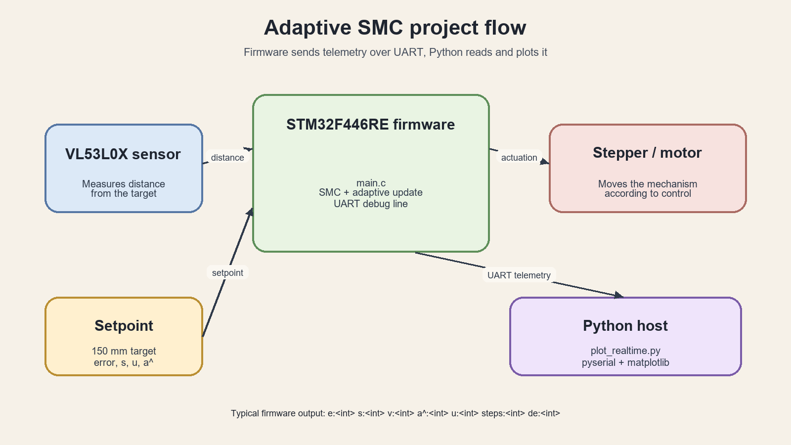
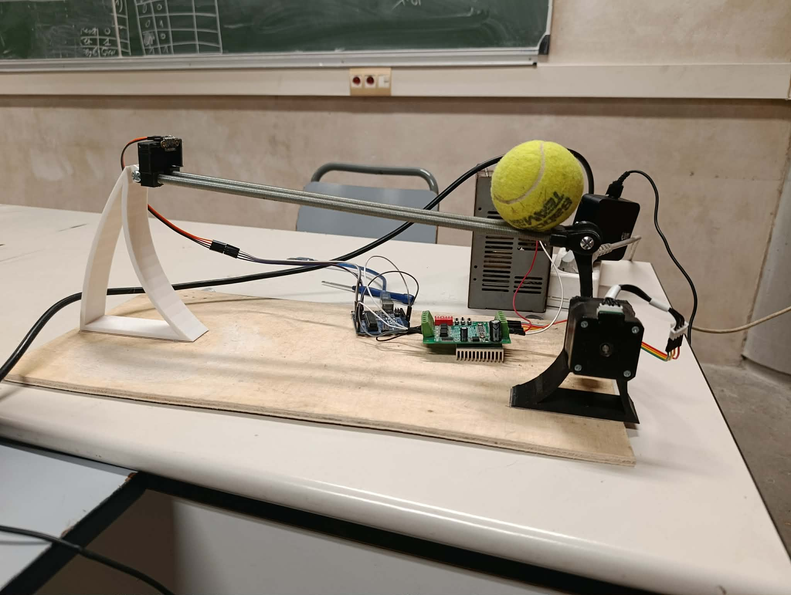

# Ball and Beam Control

Embedded control project for a ball-and-beam system using an STM32F446RE microcontroller.

## Overview

This project implements sliding-mode control (SMC) and adaptive SMC on an STM32F446RE. The beam position is measured with a VL53L0X time-of-flight sensor, while the controller drives the actuator and exchanges data over UART.

The repository also contains Python tools for generating the reference input and plotting measurements in real time.

*The physical ball-and-beam prototype: the beam is tilted by a servo-driven actuator while the VL53L0X sensor (mounted at the far end of the beam) measures the ball position, with the STM32F446RE board and motor driver visible in the foreground.*

## Main components

- STM32F446RE firmware generated and configured with STM32CubeIDE/CubeMX
- VL53L0X distance sensor interface over I2C
- Sliding-mode and adaptive sliding-mode control
- UART telemetry and control communication
- Python scripts for reference generation and real-time plotting

## Project structure

- `Core/`: application source and header files
- `Drivers/`: STM32 HAL and sensor drivers
- `generate_pic.py`: reference-signal generation utility
- `plot_realtime.py`: real-time plotting utility
- `pid_f446re.ioc`: STM32CubeMX configuration

## Getting started

1. Open the project in STM32CubeIDE.
2. Connect the STM32F446RE board and the VL53L0X sensor according to the hardware setup.
3. Build and flash the firmware.
4. Install the Python dependencies required by the plotting scripts, then run the selected utility from the project directory.

## Status

This is an engineering and research project for experimenting with ball-and-beam stabilization and robust control.